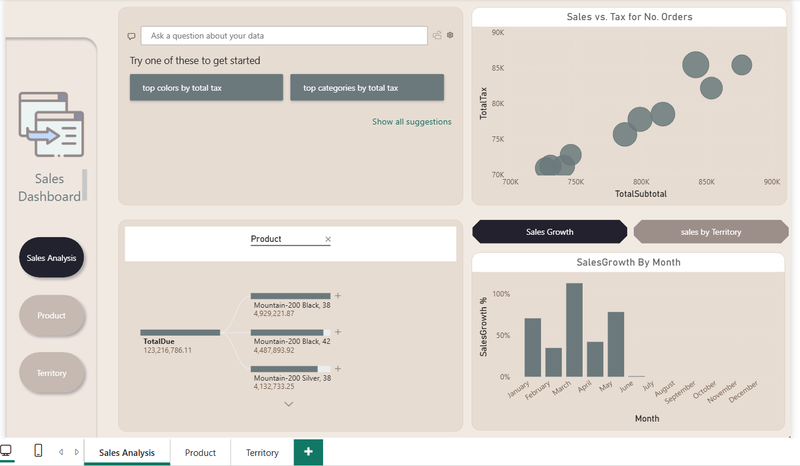
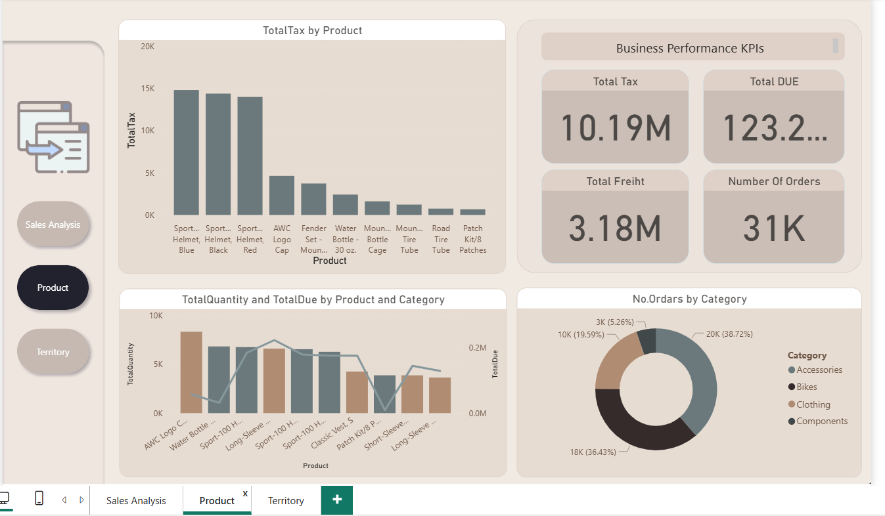
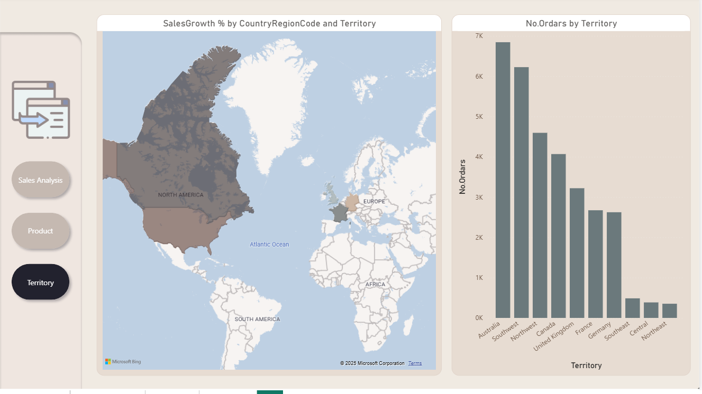

# AdventureWorksDashboard

## 📊 Project Overview
This Power BI dashboard analyzes the **AdventureWorks 2022** database to explore sales performance, territories, shipping methods, and product insights.

## 📂 Data Source
- **Database:** AdventureWorks2022 
- **Download:** [AdventureWorks 2022 Sample Database](https://github.com/Microsoft/sql-server-samples/releases/download/adventureworks/AdventureWorks2022.bak)  
- **Connection Mode:** DirectQuery  

## 🗂️ Imported Tables
- Sales.SalesOrderHeader  
- Sales.SalesOrderDetail  
- Sales.SalesTerritory  
- Purchasing.ShipMethod  
- Production.Product  
- Production.ProductSubcategory  
- Production.ProductCategory  
- Sales.vSalesPerson  

## 🛠️ Data Transformations
- Created **Status** table (based on `ufnGetSalesOrderStatusText`)  
- Created **Dates** table (Power Query / DAX)  
- Renamed tables and columns for readability  
- Removed unused columns  
- Fixed errors in **TotalDue, Freight, Tax, Subtotal**  
- Designed a **Star Schema**  

## 📐 Measures
- No. Orders  
- Total Subtotal  
- Total Tax  
- Total Freight  
- Total Due  
- Total Quantity  

## 📊 Visualizations
- Line Charts (with `USERELATIONSHIP`):
  - Orders by **Order Date**  
  - Orders by **Ship Date**  
  - Orders by **Due Date**  
- No. Orders by Status  
- No. Orders by Ship Method  
- No. Orders by Category → SubCategory → Product  
- Top 10 Sales Persons (by No. Orders / Total Due)  

## 🎨 Design
- Creative and visually appealing dashboard layout  

## 🖼️ Dashboard Preview
Here are some preview screenshots of the dashboard:

  
  
  
