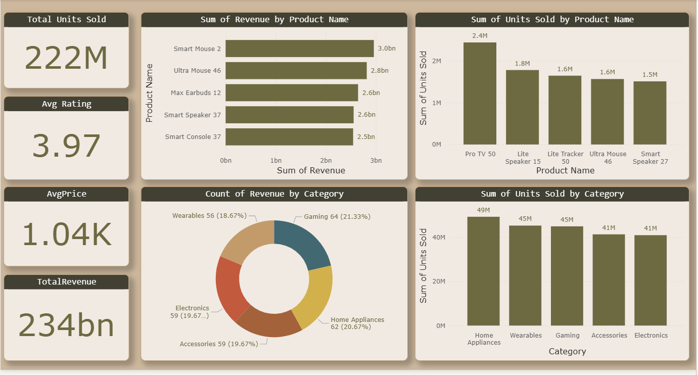

# FirstSalesDashboard

## 📊 Project Overview
This Power BI dashboard analyzes sales data to identify top-selling products and categories.

## 📂 Data Source
- **File:** Top_Selling_Products.xlsx

## 🛠️ Data Transformations
- Created custom column **Revenue** = Units Sold * Price
- Created custom column **Age Category** (New / Old based on Year Released)

## 📐 Measures
- TotalUnitsSold  
- TotalRevenue  
- AvgRating  
- AvgPrice  

## 📊 Visualizations
- Total Units Sold (Card)
- Total Revenue (Card)
- Average Rating (Card)
- Average Price (Card)
- Revenue by Product Name
- Units Sold by Product Name
- Revenue by Category
- Units Sold by Category

## 🖼️ Dashboard Preview

