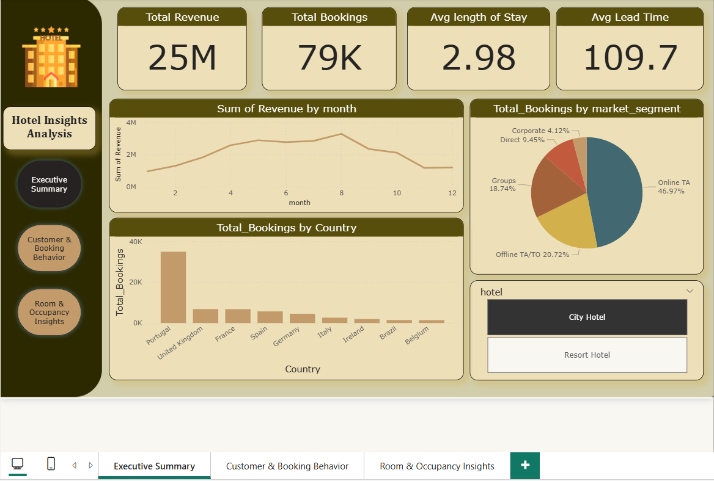
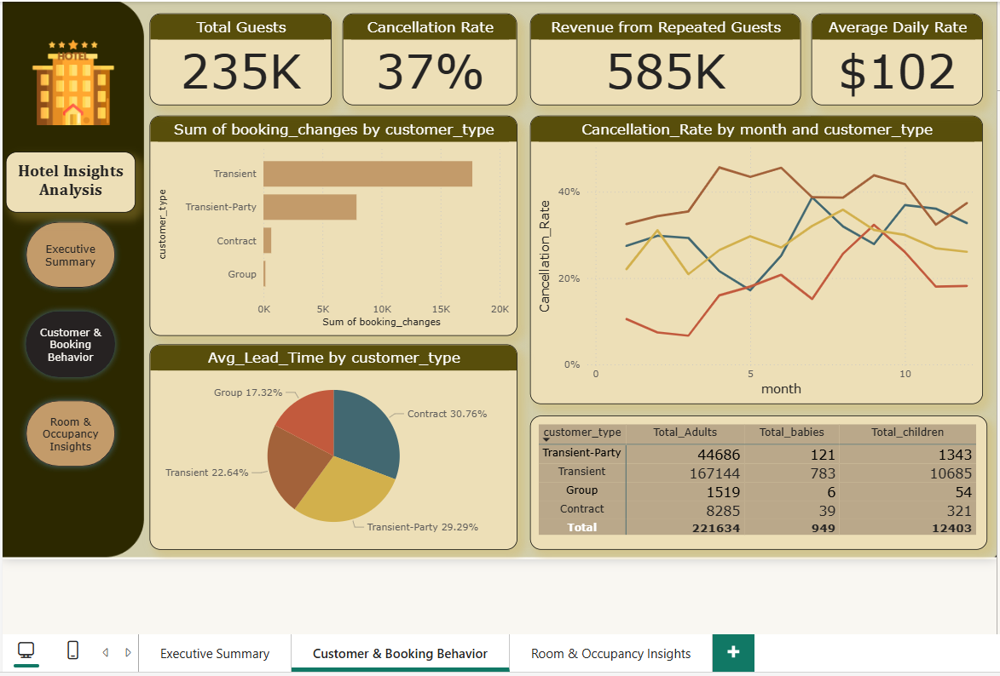
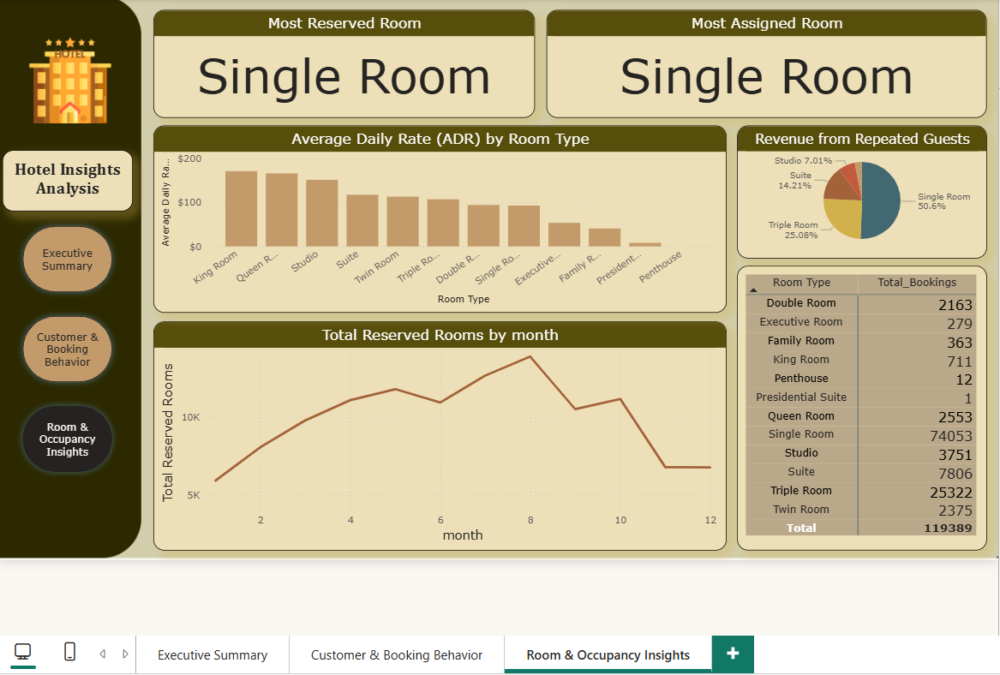

# 🏨 Hotels Dashboard – Power BI

## 📌 Overview
This project analyzes hotel booking data to uncover trends, performance metrics, and customer behavior.  
The dashboard provides insights into **Revenue, Occupancy, Cancellations, and Customer Segments**, helping hotel management improve decision-making.

---

## 📂 Data Preparation
- **Source:** `hotels.csv`
- **Steps:**
  - Imported dataset into **Power BI Desktop**.
  - Cleaned missing values & corrected data types.
  - Created calculated columns for:
    - `Revenue = ADR * Nights * (1 - CancellationRate)`
    - `Length of Stay = Checkout - Checkin`
    - `Peak Season` flag based on month.
  - Documented all transformations in **Power Query**.

---

## 📊 Key Performance Indicators (KPIs)
- 🛎️ **Total Bookings**  
- 💵 **Total Revenue**  
- 📉 **Cancellation Rate**  
- 🏨 **Occupancy Rate**  
- 📈 **Average Daily Rate (ADR)**  

---

## 📈 Insights & Visualizations
- **Trends:** Monthly revenue & bookings over time.  
- **Segments:** Breakdown by **Hotel Type, Market Segment, Customer Type**.  
- **Customer Behavior:** Lead time, country of origin analysis.  
- **Rooms & Pricing:** Distribution of **Room Types** and **ADR**.  

---

## 🎨 Dashboard Design
- Professional color palette & clean layout.  
- Interactive slicers: **Date, Hotel Type, Market Segment**.  
- Customized tooltips for more detail.  

---

## 📷 Dashboard Screenshots
  
  
  

