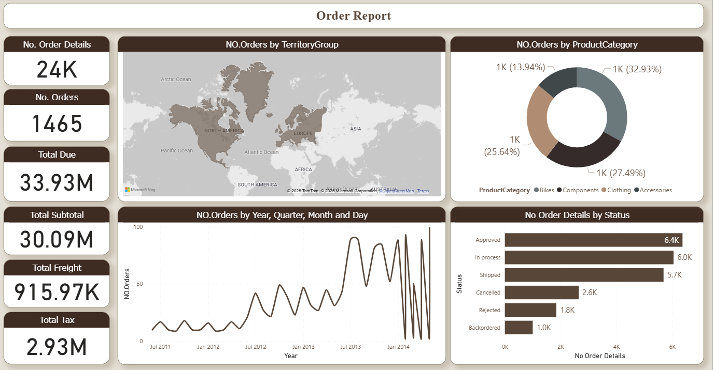

# SalesReport  

## 📊 Project Overview  
This Power BI dashboard analyzes sales orders, product hierarchy, and financial metrics to provide insights into sales performance.  

## 📂 Data Source  
- **File:** Sales.xlsx  

## 🛠️ Data Transformations  
- Converted the data into a **Star Schema** (Fact + Dimension tables).  
- Created a **Product Hierarchy**: Category → SubCategory → Product.  

## 📐 Measures  
- No. Orders  
- No. Order Details  
- Total Subtotal  
- Total Tax  
- Total Freight  
- Total Due  

## 📊 Visualizations  
- No. Orders (Card)  
- No. Order Details (Card)  
- Total Subtotal (Card)  
- Total Tax (Card)  
- Total Freight (Card)  
- Total Due (Card)  
- No. Orders by OrderDate  
- No. Orders by Status  
- No. Orders by Category, SubCategory, Product  
- No. Orders by Territory  

## 🖼️ Dashboard Preview  
  
